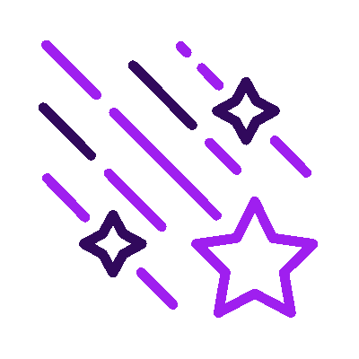

<h1>👨🏻‍💻 About me</h1>

 

<table border="0" cellpadding="0" cellspacing="0" width="100%">
  <tr>
    <td valign="middle" width="60%">
      

        🌎 I'm from <strong>Minas Gerais, Brazil</strong>
         
        💻 <strong>Back-end Developer</strong> & Information Systems Student
         
        🧠 Currently focused on <strong>Java, QA, and AI</strong>
         
        🌌 Passionate about astronomy & ecology
         
        🎮 Enjoy gaming and exploring new technologies
         
        🎨 Passionate about <strong>music, books, movies, and art</strong>
         
        📚 Enthusiast of sharing knowledge and learning new things
      

    </td>
    <td valign="middle" align="right" width="40%">
      
    </td>
  </tr>
</table>

 
 

<h1>🗣️ Languages</h1>

  🇧🇷 <strong>Portuguese:</strong> Native
   
  🇺🇸 <strong>English:</strong> C1 (Advanced)
   
  🇪🇸 <strong>Spanish:</strong> B2 (Upper Intermediate)

  

<h1>🤝 Collaboration</h1>

  I'm looking to collaborate on projects related to <strong>Science, Education, and Sustainability</strong>.

  

<h1>🛠️ Technologies & Tools</h1>

  <h3>💻 Languages & Frameworks</h3>
  

    
    
    
    
    
    
    
  

   

  <h3>🗄️ Databases</h3>
  

    
    
    
  

   

  <h3>🛠️ Tools & DevOps</h3>
  

    
    
    
    
    
    
    
    
    
    
    
  

 
 

 

  <i>Thanks for passing by!</i>
   
  

    <i>Let's connect!</i>
     
    
  

  

###
